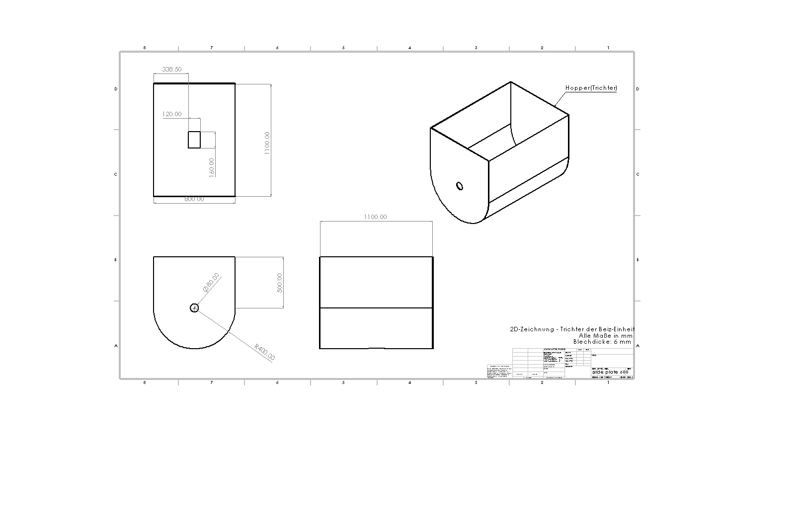

# Abin Sabu – Materials & Mechanical Engineering Portfolio

Hi! I'm a Master's student in Metallic Materials Technology at TU Bergakademie Freiberg.  
This portfolio will showcase my projects in materials engineering and mechanical design.
---

## Projects

### 1️⃣ My First Project
- **Problem:** Example: design a lightweight mechanical bracket
- **Tools:** SolidWorks, Excel
- **Result:** [View PDF](side plate 600.JPG)

